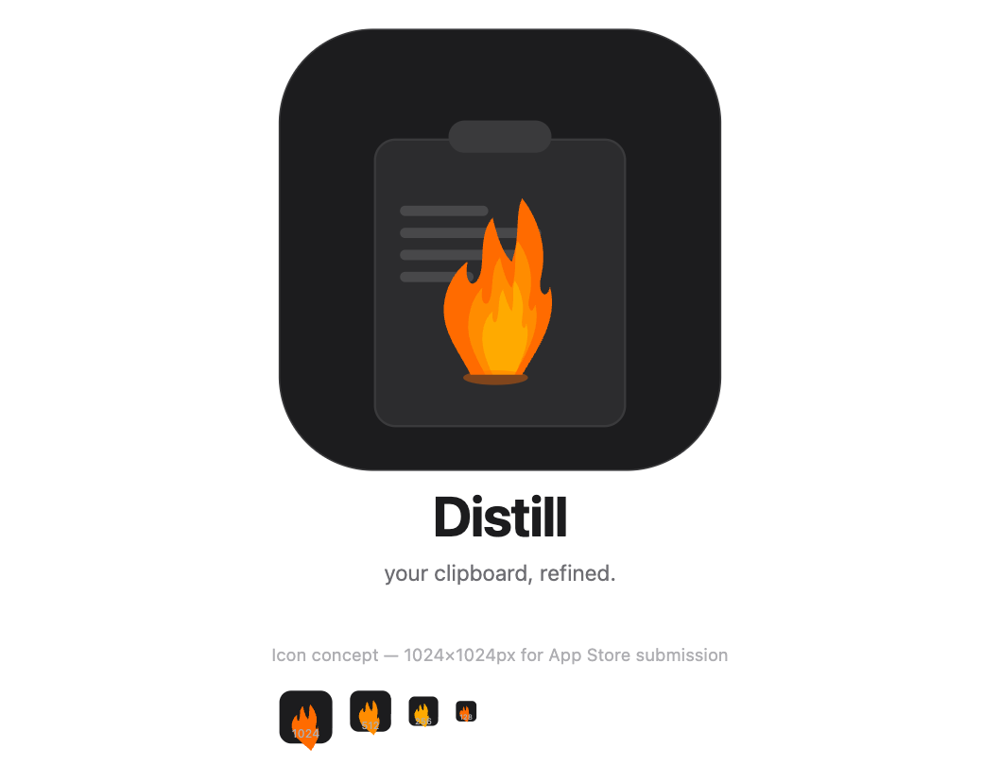

# Distill — Zero to App Store

> A native macOS clipboard manager with smart paste transforms.  
> Stack: Swift + AppKit | Target: macOS 13+ | Goal: $9.99 one-time purchase

---

## Table of Contents

1. [Product Overview](#1-product-overview)
2. [Technical Stack](#2-technical-stack)
3. [Phase 1 — Project Setup](#3-phase-1--project-setup)
4. [Phase 2 — Core Features](#4-phase-2--core-features)
5. [Phase 3 — Transform Engine](#5-phase-3--transform-engine)
6. [Phase 4 — UI & Polish](#6-phase-4--ui--polish)
7. [Phase 5 — Monetization](#7-phase-5--monetization)
8. [Phase 6 — App Store Submission](#8-phase-6--app-store-submission)
9. [Phase 7 — Launch & Marketing](#9-phase-7--launch--marketing)
10. [Timeline Summary](#10-timeline-summary)
11. [File Structure](#11-file-structure)
12. [Key Code Snippets](#12-key-code-snippets)

---

## 1. Product Overview

### What it is
A menubar app that combines clipboard history (inspired by Maccy) with an instant transform layer — letting users paste content in exactly the format they need.

### Core value proposition
> "Copy anything. Paste it perfectly."

### Target users
- macOS developers reformatting code snippets
- Writers cleaning up text copied from PDFs or web pages
- Data analysts transforming JSON, CSVs, and lists
- Operations teams reformatting customer data daily

### v1 Feature set

**Clipboard history**
- Store last 200 items
- Searchable with `CMD+Shift+V`
- Pin frequently used snippets

**Transform layer**
- Apply transforms before pasting
- Auto-detect content type (JSON, URL, code, plain text)
- One-click or hotkey transform selection

**Transforms included in v1**
- UPPERCASE / lowercase / Title Case / Sentence case
- Trim whitespace / remove blank lines / remove duplicate lines
- Sort lines A–Z / Z–A
- Extract all URLs
- Format JSON / minify JSON
- Base64 encode / decode
- Remove markdown formatting
- Wrap in quotes / backticks / brackets
- Count words and characters
- Remove line breaks (single line)
- Strip HTML tags

---

## 2. Technical Stack

| Layer | Technology |
|---|---|
| Language | Swift 5.9+ |
| UI Framework | AppKit (native macOS) |
| Minimum OS | macOS 13 Ventura |
| Persistence | UserDefaults (settings) + Core Data (clipboard history) |
| Hotkeys | Carbon framework (`RegisterEventHotKey`) |
| Distribution | Mac App Store |
| Monetization | One-time purchase ($9.99) |

### Why AppKit over SwiftUI
- Full control over the floating panel behavior
- Better keyboard event handling
- More reliable menubar integration on macOS 13/14/15
- SwiftUI is fine for settings window only

---

## 3. Phase 1 — Project Setup

**Duration: 2–3 days**

### 3.1 Xcode project configuration

1. Create new macOS project → App template
2. Set bundle ID: `com.yourname.distill`
3. Set minimum deployment: macOS 13.0
4. Remove default window scenes from `Info.plist`
5. Set `LSUIElement = YES` in `Info.plist` (hides from Dock, menubar-only app)
6. Set `NSPrincipalClass` to your `AppDelegate`

### 3.2 Entitlements

Create `Distill.entitlements`:

```xml
<key>com.apple.security.app-sandbox</key>
<true/>
<key>com.apple.security.temporary-exception.apple-events</key>
<array>
  <string>com.apple.systemevents</string>
</array>
```

> Note: App Sandbox is required for Mac App Store. Design around it from day one.

### 3.3 Capabilities (Xcode → Signing & Capabilities)
- App Sandbox ✓
- Hardened Runtime ✓
- User Selected Files: Read/Write (for future export features)

### 3.4 Project folders to create

```
Distill/
├── App/
├── Clipboard/
├── Transforms/
├── UI/
│   ├── MenuBar/
│   ├── Panel/
│   └── Settings/
├── Models/
├── Persistence/
└── Resources/
```

---

## 4. Phase 2 — Core Features

**Duration: 5–6 days**

### 4.1 Menubar icon

Create `MenuBarManager.swift`:
- Use `NSStatusBar.system.statusItem`
- Set icon: SF Symbol `doc.on.clipboard` or custom 18×18pt icon
- Show/hide panel on click
- Right-click → show settings/quit menu

### 4.2 Clipboard monitoring

Create `ClipboardMonitor.swift`:
- Poll `NSPasteboard.general` every 0.5 seconds
- Check `changeCount` to detect new copies
- Filter out duplicates (compare with last item)
- Ignore copies made by the app itself (set a flag before programmatic writes)
- Store each new item to Core Data

```swift
// Core polling logic
Timer.scheduledTimer(withTimeInterval: 0.5, repeats: true) { _ in
    let newCount = NSPasteboard.general.changeCount
    if newCount != self.lastChangeCount {
        self.lastChangeCount = newCount
        if let content = NSPasteboard.general.string(forType: .string) {
            self.handleNewClipboardItem(content)
        }
    }
}
```

### 4.3 Core Data model

Entity: `ClipboardItem`
- `id`: UUID
- `content`: String
- `contentType`: String (auto-detected: json, url, code, plain)
- `timestamp`: Date
- `isPinned`: Bool
- `useCount`: Int32

### 4.4 Global hotkey

Register `CMD+Shift+V` using Carbon:

```swift
import Carbon

func registerHotkey() {
    var hotKeyRef: EventHotKeyRef?
    let hotKeyID = EventHotKeyID(signature: fourCharCode("PSTX"), id: 1)
    let keyCode = UInt32(kVK_ANSI_V)
    let modifiers = UInt32(cmdKey | shiftKey)
    RegisterEventHotKey(keyCode, modifiers, hotKeyID, GetApplicationEventTarget(), 0, &hotKeyRef)
}
```

> Important: Global hotkeys work even when your app is not focused. Test this early.

### 4.5 Floating panel

Create `ClipboardPanel.swift` using `NSPanel`:
- `NSBorderlessWindowMask` for frameless look
- `NSFloatingWindowLevel` so it appears above other apps
- Show near cursor position on hotkey press
- Dismiss on Escape or click outside (use `NSEvent.addGlobalMonitorForEvents`)
- Animate in with a subtle fade + slight scale

---

## 5. Phase 3 — Transform Engine

**Duration: 3–4 days**

### 5.1 Transform protocol

```swift
protocol Transform {
    var id: String { get }
    var name: String { get }
    var icon: String { get }          // SF Symbol name
    var applicableTo: [ContentType] { get }
    func apply(to input: String) -> String
}
```

### 5.2 Content type detection

```swift
enum ContentType {
    case json, url, code, list, plainText
}

func detectContentType(_ text: String) -> ContentType {
    if text.trimmingCharacters(in: .whitespaces).hasPrefix("{") ||
       text.trimmingCharacters(in: .whitespaces).hasPrefix("[") {
        return .json
    }
    if text.hasPrefix("http://") || text.hasPrefix("https://") {
        return .url
    }
    if text.components(separatedBy: "\n").count > 2 {
        return .list
    }
    return .plainText
}
```

### 5.3 All v1 transforms to implement

| Transform | Input type | Logic |
|---|---|---|
| UPPERCASE | any | `.uppercased()` |
| lowercase | any | `.lowercased()` |
| Title Case | plain | capitalize each word |
| Sentence case | plain | capitalize first letter only |
| Trim whitespace | any | `.trimmingCharacters(in: .whitespacesAndNewlines)` |
| Remove blank lines | list | filter empty lines |
| Remove duplicates | list | use `NSOrderedSet` |
| Sort A–Z | list | `.sorted()` |
| Sort Z–A | list | `.sorted().reversed()` |
| Format JSON | json | `JSONSerialization` with `.prettyPrinted` |
| Minify JSON | json | `JSONSerialization` without options |
| Base64 encode | any | `Data.base64EncodedString()` |
| Base64 decode | any | `Data(base64Encoded:)` |
| Extract URLs | any | `NSDataDetector` with `.link` type |
| Remove markdown | markdown | regex strip `**`, `_`, `#`, etc. |
| Wrap in backticks | code | wrap with `` ` `` |
| Wrap in quotes | plain | wrap with `"` |
| Strip HTML | html | regex remove `<[^>]+>` |
| Remove line breaks | any | replace `\n` with space |
| Word / char count | any | display count (no paste) |

### 5.4 Smart suggestions

After detecting content type, surface the 3 most relevant transforms at the top of the picker, highlighted. For example:
- Detected JSON → show Format JSON, Minify JSON, Copy as Base64 first
- Detected list → show Sort A–Z, Remove Duplicates, Remove Blank Lines first

---

## 6. Phase 4 — UI & Polish

**Duration: 4–5 days**

### 6.1 Panel layout

```
┌─────────────────────────────────────┐
│ 🔍  Search clipboard history...      │
├─────────────────────────────────────┤
│ 📌 PINNED                           │
│  ┌─ "npm install && npm run dev"    │
│  └─ "https://myapi.example.com/..."  │
├─────────────────────────────────────┤
│ RECENT                              │
│  ┌─ { "user": "john", "id": 42 }   │  ← JSON badge
│  ├─ SELECT * FROM users WHERE...    │  ← Code badge
│  └─ Meeting notes from Tuesday...   │
├─────────────────────────────────────┤
│ [Paste]  [Transform ▾]  [Pin]  [✕]  │
└─────────────────────────────────────┘
```

When "Transform ▾" is clicked, show a popover with categorized transforms.

### 6.2 Design guidelines
- Follow macOS Human Interface Guidelines
- Use system colors (`NSColor.labelColor`, `.secondaryLabelColor`)
- Support both light and dark mode automatically (use semantic colors only)
- Corner radius: 10pt for the panel
- Use `NSVisualEffectView` with `.hudWindow` material for the background blur
- Monospaced font for code/JSON previews (`NSFont.monospacedSystemFont`)

### 6.3 Settings window

Build in SwiftUI (`SettingsView.swift`):

**General tab**
- Launch at login toggle
- Hotkey customization
- Max history size (50 / 100 / 200 / 500)
- Clear history button

**Transforms tab**
- Enable/disable individual transforms
- Reorder transforms (drag to reorder)

**About tab**
- Version number
- Link to website / support email
- Acknowledgements

### 6.4 Onboarding

First launch: show a 3-step welcome window:
1. Grant accessibility permission (required for global hotkey)
2. Grant paste permission
3. "You're ready — press CMD+Shift+V anywhere"

### 6.5 Accessibility permission prompt

The app needs Accessibility access to simulate paste. Handle this gracefully:

```swift
let options = [kAXTrustedCheckOptionPrompt.takeRetainedValue(): true]
let trusted = AXIsProcessTrustedWithOptions(options as CFDictionary)
if !trusted {
    showAccessibilityPermissionAlert()
}
```

---

## 7. Phase 5 — Monetization

**Duration: 1 day**

### 7.1 Pricing
- **One-time purchase: $9.99**
- No subscription, no freemium — positioned as a premium indie tool

### 7.2 Free trial strategy (recommended)
Use a **time-based trial** without StoreKit complexity:
- Store `firstLaunchDate` in UserDefaults
- Allow full use for 14 days
- After trial: limit history to 10 items and disable transforms
- Show a non-intrusive "Trial expired" banner with a buy button

### 7.3 StoreKit 2 integration

```swift
import StoreKit

// Fetch product
let products = try await Product.products(for: ["com.yourname.distill.pro"])
let product = products.first!

// Purchase
let result = try await product.purchase()
switch result {
case .success(let verification):
    // Unlock app
case .userCancelled:
    break
case .pending:
    break
}
```

Set up one In-App Purchase in App Store Connect:
- Type: Non-Consumable
- Product ID: `com.yourname.distill.pro`
- Price: $9.99

### 7.4 Restore purchases
Always include a "Restore Purchase" button in Settings → About. Required by Apple.

---

## 8. Phase 6 — App Store Submission

**Duration: 3–4 days**

### 8.1 App Store Connect setup

1. Log in to [appstoreconnect.apple.com](https://appstoreconnect.apple.com)
2. Create new macOS app
3. Fill in:
   - App name: **Distill**
   - Bundle ID: match your Xcode project
   - SKU: `distill-001`
   - Primary language: English

### 8.2 Required assets

| Asset | Size |
|---|---|
| App icon | 1024×1024px PNG (no alpha) |
| Screenshots | Min 1, up to 10 per display size |
| macOS screenshot sizes | 1280×800, 1440×900, 2560×1600, 2880×1800 |

**Screenshot tips:**
- Show the panel open with real clipboard content
- Show a transform being applied with before/after
- Use your own Screenshot Studio idea to beautify them 😉

### 8.3 App Store metadata

**Name:** Distill

**Subtitle (30 chars):** Clipboard history + transforms

**Description (4000 chars max):**
```
Distill is a powerful clipboard manager for macOS that lets you 
copy anything and paste it perfectly.

CLIPBOARD HISTORY
• Stores your last 200 clipboard items
• Search instantly with CMD+Shift+V
• Pin your most-used snippets

SMART TRANSFORMS
• Format or minify JSON with one click
• Convert to UPPERCASE, lowercase, Title Case
• Sort lines, remove duplicates, extract URLs
• Base64 encode/decode
• Strip HTML, remove markdown, clean whitespace
• And 15+ more transforms

CONTENT AWARE
Distill detects what you copied and suggests the most 
relevant transforms automatically.

Built for developers, writers, and anyone who pastes for a living.
```

**Keywords (100 chars):** distill,clipboard,paste,transform,productivity,developer,JSON,formatter,history,menubar

**Category:** Productivity  
**Secondary category:** Developer Tools

### 8.4 Privacy nutrition label

In App Store Connect → Privacy:
- Data not collected ✓ (all clipboard data stays local)
- No tracking ✓

This is a major selling point — mention it in your description.

### 8.5 Build submission checklist

- [ ] Archive build in Xcode (Product → Archive)
- [ ] Validate archive (no errors)
- [ ] Upload to App Store Connect via Organizer
- [ ] Wait for processing (~15–30 min)
- [ ] Select build in App Store Connect
- [ ] Fill in export compliance (No encryption → select No)
- [ ] Submit for review

### 8.6 Review tips
- Apple will test clipboard access — make sure the onboarding explains why
- Accessibility permission prompt must be clear and honest
- Do not mention competitor app names in your App Store description
- Average review time: 24–48 hours for macOS apps

---

## 9. Phase 7 — Launch & Marketing

**Duration: ongoing**

### 9.1 Pre-launch (1 week before)

- [ ] Set up a simple landing page (even a single HTML page)
  - Hero: app name + one-line description
  - Animated GIF or video of the transform panel in action
  - "Available on the Mac App Store" badge
- [ ] Create a Twitter/X account for the app
- [ ] Post on IndieHackers introducing what you're building
- [ ] List on [Pricetag.app](https://pricetag.app) and [Setapp consideration](https://setapp.com/developers)

### 9.2 Launch day

Post on:
- **Product Hunt** — submit at 12:01am PST, have 5 friends ready to upvote and comment
- **Hacker News** — "Show HN: I built Distill — a native macOS clipboard manager with smart transforms"
- **Reddit** → r/macapps, r/MacOS, r/productivity
- **Twitter/X** → tag relevant developers and productivity accounts

### 9.3 Ongoing

- Reply to every App Store review in the first month
- Add the most-requested transforms in v1.1
- Write a dev blog post: "How I built Distill in 3 weeks"
- Submit to macOS app directories:
  - MacUpdate
  - Softpedia
  - AlternativeTo (list as alternative to Maccy, Keyboard Maestro, Alfred)

### 9.4 Pricing experiments

After 3 months, consider:
- Temporary 20% off sale ($7.99) around Black Friday
- Bundle with another indie dev's app
- Setapp listing (flat monthly revenue share, good for discoverability)

---

## 10. Timeline Summary

| Phase | Task | Duration |
|---|---|---|
| 1 | Project setup & config | 2–3 days |
| 2 | Core features (clipboard, hotkey, panel) | 5–6 days |
| 3 | Transform engine (all 20 transforms) | 3–4 days |
| 4 | UI polish & settings | 4–5 days |
| 5 | Monetization & StoreKit | 1 day |
| 6 | App Store submission prep | 3–4 days |
| 7 | Launch & marketing | 3–5 days |
| **Total** | | **~3–4 weeks** |

---

## 11. File Structure

```
Distill/
├── App/
│   ├── AppDelegate.swift          ← App entry point, menubar setup
│   └── DistillApp.swift    ← SwiftUI App wrapper (settings only)
│
├── Clipboard/
│   ├── ClipboardMonitor.swift     ← NSPasteboard polling
│   ├── ClipboardItem.swift        ← Model
│   └── ClipboardStore.swift       ← Core Data CRUD
│
├── Transforms/
│   ├── Transform.swift            ← Protocol definition
│   ├── TransformRegistry.swift    ← All transforms registered here
│   ├── ContentDetector.swift      ← Auto-detect content type
│   └── Transforms/
│       ├── CaseTransforms.swift
│       ├── ListTransforms.swift
│       ├── JSONTransforms.swift
│       ├── EncodingTransforms.swift
│       └── CleanupTransforms.swift
│
├── UI/
│   ├── MenuBar/
│   │   └── MenuBarManager.swift
│   ├── Panel/
│   │   ├── ClipboardPanel.swift   ← NSPanel subclass
│   │   ├── ClipboardPanelVC.swift ← View controller
│   │   ├── ClipboardItemCell.swift
│   │   └── TransformPickerView.swift
│   └── Settings/
│       ├── SettingsView.swift     ← SwiftUI
│       ├── GeneralSettingsView.swift
│       └── TransformSettingsView.swift
│
├── Monetization/
│   ├── PurchaseManager.swift      ← StoreKit 2
│   └── TrialManager.swift
│
├── Persistence/
│   └── Distill.xcdatamodeld
│
└── Resources/
    ├── Assets.xcassets
    └── Info.plist
```

---

## 12. Key Code Snippets

### Simulate paste after transform

```swift
func distilledText(_ text: String) {
    // 1. Set flag so our monitor ignores this write
    ClipboardMonitor.shared.isAppWriting = true
    
    // 2. Write to pasteboard
    NSPasteboard.general.clearContents()
    NSPasteboard.general.setString(text, forType: .string)
    
    // 3. Dismiss our panel
    ClipboardPanel.shared.orderOut(nil)
    
    // 4. Small delay to let the panel close and focus return
    DispatchQueue.main.asyncAfter(deadline: .now() + 0.1) {
        // 5. Simulate CMD+V
        let source = CGEventSource(stateID: .hidSystemState)
        let keyDown = CGEvent(keyboardEventSource: source, virtualKey: 0x09, keyDown: true)
        let keyUp = CGEvent(keyboardEventSource: source, virtualKey: 0x09, keyDown: false)
        keyDown?.flags = .maskCommand
        keyUp?.flags = .maskCommand
        keyDown?.post(tap: .cghidEventTap)
        keyUp?.post(tap: .cghidEventTap)
        
        ClipboardMonitor.shared.isAppWriting = false
    }
}
```

### Format JSON transform

```swift
struct FormatJSONTransform: Transform {
    var id = "format_json"
    var name = "Format JSON"
    var icon = "curlybraces"
    var applicableTo: [ContentType] = [.json]
    
    func apply(to input: String) -> String {
        guard let data = input.data(using: .utf8),
              let object = try? JSONSerialization.jsonObject(with: data),
              let formatted = try? JSONSerialization.data(withJSONObject: object, options: .prettyPrinted),
              let result = String(data: formatted, encoding: .utf8) else {
            return input // return original if not valid JSON
        }
        return result
    }
}
```

### Launch at login (macOS 13+)

```swift
import ServiceManagement

func setLaunchAtLogin(_ enabled: Bool) {
    if enabled {
        try? SMAppService.mainApp.register()
    } else {
        try? SMAppService.mainApp.unregister()
    }
}
```

---


---

## 13. App Icon

Below is the Distill icon concept — a forge flame rising from a clipboard. Use this as a reference for your designer or as a starting point for the 1024×1024px App Store asset.


> Export at 1024×1024px with no alpha channel (solid background) for App Store submission.  
> Also export at 512×512, 256×256, 128×128, 64×64, 32×32, 16×16 for the `.icns` file.


*Built with ❤️ as a native macOS app. No Electron. No cloud. Your clipboard never leaves your Mac.*
